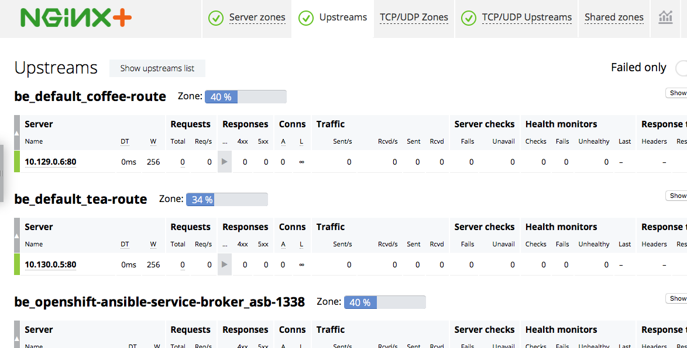

# Cafe App Example

In this example we deploy the NGINX Plus Router, a simple web application and then expose that application using the Router.

## Running the Example

## 1. Deploy the NGINX Plus Router

1. Follow the installation instructions for [NGINX Plus](../../docs/nginx-plus-router-install.md).

1. Save the public IP address of the node where the Router is running into a shell variable:
    ```
    $ export ROUTER_IP=xxx.xxx.xxx.xxx
    ```
## 2. Deploy the Cafe Application

1. The cafe application container runs its application as root user. Before deploying the application, allow containers with root access:
    ```
    $ oc adm policy add-scc-to-group anyuid system:authenticated
    ```
1. Create the deployments and services for the coffee and tea applications
    ```
    $ oc create -f cafe.yaml
    ```

## 3. Create the Routes

```
$ oc create -f tea-route.yaml
$ oc create -f coffee-route.yaml
```

**A note about edge (TLS) termination**: The coffee-route route configured edge termination for `cafe.example.com` host using a self-signed TLS certificate and key. Note that if edge termination is enabled for a host in one route, it will be enabled in all other routes that reference that host as well. Thus, we only need to configure edge termination in the coffee-route route. This behavior is different from the default Router behavior, where you would have to enable edge termination in every route.

## 4. Test the Application

1. To access the application, curl the coffee and the tea services. We'll use `curl`'s --insecure option to turn off certificate verification of our self-signed
certificate and the --resolve option to set the Host header of a request with `cafe.example.com`:
    
    To get coffee:
    ```
    $ curl --resolve cafe.example.com:443:$ROUTER_IP https://cafe.example.com/coffee --insecure
    Server address: 10.129.0.6:80
    Server name: coffee-7586895968-r26zn
    ...
    ```
    If you would rather prefer tea:
    ```
    $ curl --resolve cafe.example.com:443:$ROUTER_IP https://cafe.example.com/tea --insecure
    Server address: 10.130.0.5:80
    Server name: tea-7cd44fcb4d-xfw2x
    ...
    ```

1. Open the live activity monitoring dashboard:
    1. Follow the [instructions](../../docs/nginx-plus-router-install.md#4-Access-the-Live-Activity-Monitoring-Dashboard) to access the dashboard. 
    1. If you go to the Upstream tab, you'll see: 